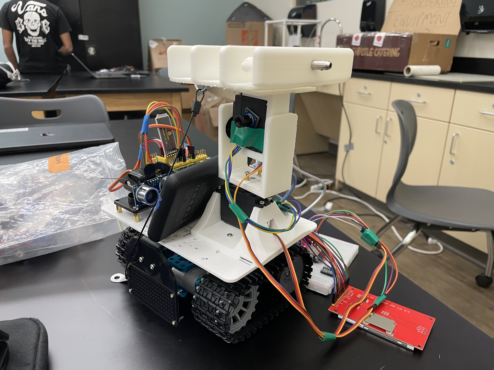
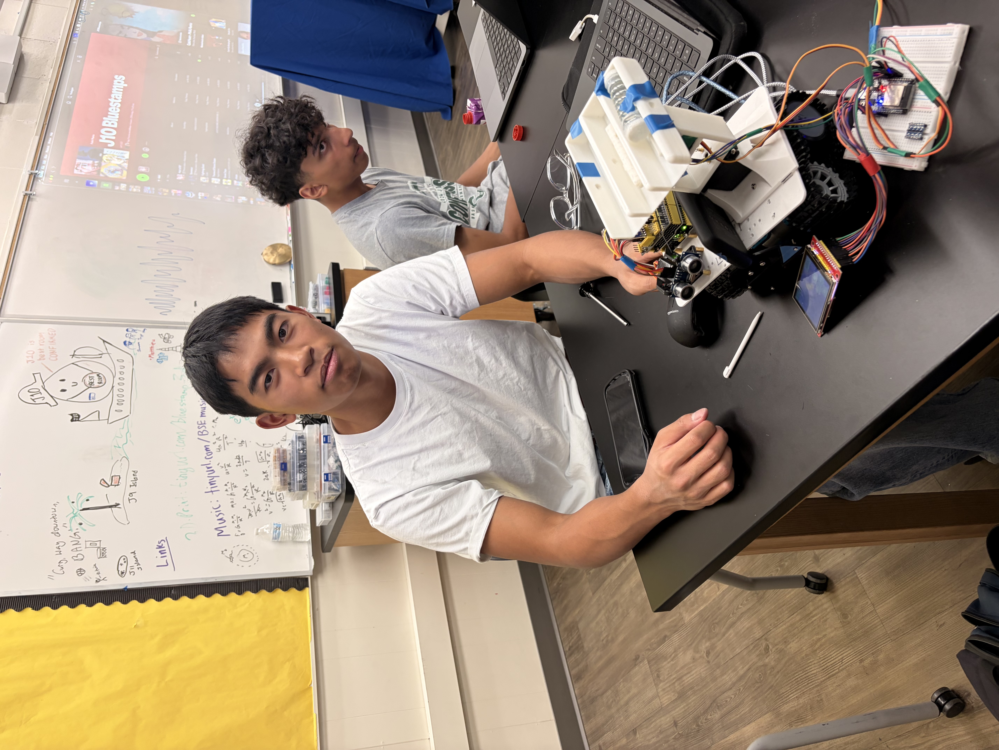
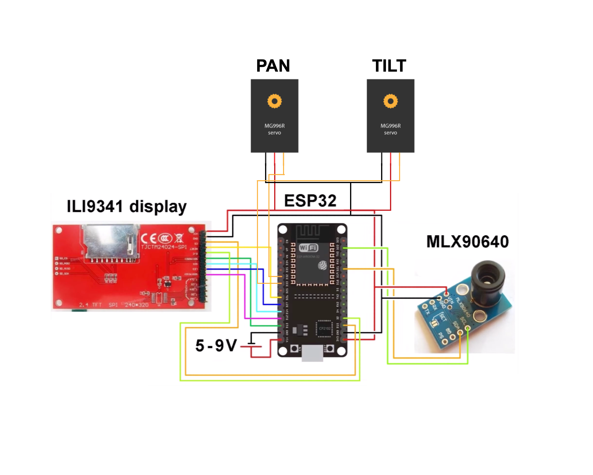

# Mini Tank Robot
My Mini tank Robot consists of using an Arduino UNO and Sensor Shield v5.0 to drive the Mini Tank Robot, as well as using servo motors to control a thermal camera and a rocket turret.Building a Mini Tank Robot had lots of challenges, ranging from having to find a new power source to trying to get the robot to drive. By far, my favorite part of this project has been assembling my project and being able to see all of the components work as intended.

| **Engineer** | **School** | **Area of Interest** | **Grade** |
|:--:|:--:|:--:|:--:|
| Hudson S | Westmont Highschool | Mechanical Engineering | Incoming Senior


  
# Final Milestone

<iframe width="560" height="315" src="https://www.youtube.com/embed/F7M7imOVGug" title="YouTube video player" frameborder="0" allow="accelerometer; autoplay; clipboard-write; encrypted-media; gyroscope; picture-in-picture; web-share" allowfullscreen></iframe>

## Summary
In this milestone I focused on modifying my project. I 3d printed a rocket holder, a turret for the rocket holder, and the rockets themselves. Aswell as implemented a thermal camera to track heat that I can manually have the rockets lock onto. This works by having the thermal camera track the hottest source and when I click lock on the touchscreen it automatically locks onto the hottest heat source within the touchscreen. 

## Things I learned
This milestone taught me lots of things, it further improved my CAD skills with trying to create 3 seperate parts and thinking about how theyll all connect together. I also learned how to connect a ESP32 to a touchscreen as the specific touchscreen I used (ILI9341) could only support an ESP32. With this in mind I had to run both an Arduino UNO and a ESP32 on my Mini Tank Robot and had them run seperately from each other. As the ESP32 is 3.3 Volt microcontroller and a Arduino UNO is a 5 Volt microcontroller, meaning that if I connected them it would short circuit. Finally, I learned that an MG996R motor can only turn 180 degrees due to an internal feedback potentiometer, and built in gears that stops it from turning further. 

## Challenges faced
I faced many challenges during this milestone when it came to the IR Thermal camera and rockets. Some of the challenges I faced was trying to get the thermal camera (MLX90640) to automatically lock onto heated objects. While simultaneously at the same time have the thermal camera mounted onto servo motors to have it scan an area of heated objects. However, when the thermal camera was scanning for heated objects it would end up detecting its own heat from its motor and lock onto itself. To fix this problem I decided I had to pivot from the motors being automatic to manual. Making the thermal camera manual consisted of using the touchscreen the thermal camera was displaying on and adding buttons on the touchscreen to manually control the servo motors. 

Another challenge I faced was finding a correct spring size for my rockets. I had initially ordered a spring that fit inside of the rocket holder. However this spring was too long and also too stiff for the rocket. As time was running out I had to improvise by cutting down the size of the rocket and also using clamps to compress the spring in order to load the rocket. Though this is only a temporary solution until I eventually get new springs on my own. 

## The Future
After learning a variety of skills from BlueStamp Engineering from soldering to using CAD I hope to create more projects in the future. Utilizing my new CAD skills I want to be able to create my own 3d prints, and projects on my own and I hope to learn more skills based off of what I know now. 



# Second Milestone

<iframe width="560" height="315" src="https://www.youtube.com/embed/YkA2mTx3aO4?si=McGtIobe3QWB95xG" title="YouTube video player" frameborder="0" allow="accelerometer; autoplay; clipboard-write; encrypted-media; gyroscope; picture-in-picture; web-share" referrerpolicy="strict-origin-when-cross-origin" allowfullscreen></iframe>

## Summary

In this milestone I was able to connect the Mini Tank Robot to bluetooth. This allowed me to control the Mini Tank robot with my phone. This was due to me installing the bluetooth module onto the robot which allowed the robot to take inputs and perform output actions from my phone. The bluetooth module also helped display the distance of an object infront of the robot through the ultrasonic distance sensor and displaying it on an app on my phone. 

## Things I learned
This project suprised me by me learning about new things at a relatively fast pace, as I didn't know how to connect Arduino components to bluetooth along with coding Arduino prior to the project. Before I reach my final milestone, I need to figure out what materials I want to use, along with where I want to place all of the components. My idea is to put rockets ontop of the Mini Tank Robot and have them launch and it may be challenging to find a way to fit everything and make sure everything works. 

## Challenges faced

During this milestone I had trouble putting together the components. I had trouble finding out how to make the robot controllable via bluetooth, display a distance of an object infront of it, and also have the servomotor turn. I was able to figure out how to put the code together by using curly braces and putting the code into the voidloop or the voidsetup. However the actions were still being delayed due to some of the code being in seconds instead of milliseconds. I fixed this by making sure that all of the code used milliseconds instead of seconds to make all of the components respond to each other faster.

# First Milestone

<iframe width="560" height="315" src="https://www.youtube.com/embed/0TFiV7wv_90?si=M8jecxFUCus5Npow" title="YouTube video player" frameborder="0" allow="accelerometer; autoplay; clipboard-write; encrypted-media; gyroscope; picture-in-picture; web-share" referrerpolicy="strict-origin-when-cross-origin" allowfullscreen></iframe>

## Summary

I built my Mini Tank Robot using tank treads, wheels, motors, a led lightboard, a battery pack, a Arduino Uno, and a battery pack. The Arduino Uno allowed me to code the robot using Arduino IDE (Integrated Development Environment). This code let the robot perform certain functions like moving forward, backward, left, and right. In addition to that it calculated the distance of the Mini Tank Robot from an object infront of it along with connect to bluetooth to be controlled by a mobile device. The LED lightboard displayed what function the robot was going through, for example whenever the robot was about to stop the LED lightboard displayed STOP, and when it was going forward it displayed a front arrow. The Motors helped drive the robot by moving the wheels and the treads. My plan to complete my project is to first build the full robot and test all the sensors using Arduino IDE and then connect it to bluetooth and add further modifications. 

## Challenges faced

Some challenges I faced was trying to upload code to the Mini Tank Robot. I tried switching out the Arduino UNO, along with modifying my code to ensure that there weren't any errors. However, I realized that the problem was due to me having a bluetooth module connected to the Arduino. This bluetooth module prevents new code from being uploaded to the robot when its connected to the Arduino, and so I learned to remove it whenever uploading new code. Another challenge I faced was finding a way to power the robot without it being plugged into the laptop. Since we didn't have 18650 batteries that the Mini Tank Robot originally took, I had to improvise. I decided that I would connect the robot to a battery pack connected to a usb port instead of using batteries. 

# Schematics 



# Code
Driving Code
```c++
/*
 keyestudio Mini Tank Robot v2.0
 lesson 14.2
 bluetooth tank
 http://www.keyestudio.com
 -- modified for faster ultrasonic readings (non-blocking servo) --
 -- modified to add 2x MG90S servos on pins 7 and 6 (SensorShield V5.2) --
 -- servo2 & servo3 now slow, limited-angle sweep servos (reverse at end stops) --
*/

unsigned char start01[] = {0x01,0x02,0x04,0x08,0x10,0x20,0x40,0x80,0x80,0x40,0x20,0x10,0x08,0x04,0x02,0x01};
unsigned char front[] = {0x00,0x00,0x00,0x00,0x00,0x24,0x12,0x09,0x12,0x24,0x00,0x00,0x00,0x00,0x00,0x00};
unsigned char back[] = {0x00,0x00,0x00,0x00,0x00,0x24,0x48,0x90,0x48,0x24,0x00,0x00,0x00,0x00,0x00,0x00};
unsigned char left[] = {0x00,0x00,0x00,0x00,0x00,0x00,0x44,0x28,0x10,0x44,0x28,0x10,0x44,0x28,0x10,0x00};
unsigned char right[] = {0x00,0x10,0x28,0x44,0x10,0x28,0x44,0x10,0x28,0x44,0x00,0x00,0x00,0x00,0x00,0x00};
unsigned char STOP01[] = {0x2E,0x2A,0x3A,0x00,0x02,0x3E,0x02,0x00,0x3E,0x22,0x3E,0x00,0x3E,0x0A,0x0E,0x00};
unsigned char clear[] = {0x00,0x00,0x00,0x00,0x00,0x00,0x00,0x00,0x00,0x00,0x00,0x00,0x00,0x00,0x00,0x00};

#define SCL_Pin  A5
#define SDA_Pin  A4

#define ML_Ctrl 13
#define ML_PWM 11
#define MR_Ctrl 12
#define MR_PWM 3

char bluetooth_val;
int trigPin = 5;
int echoPin = 4;
long duration, cm, inches;

#include <Servo.h>
Servo myservo;   // ultrasonic sweep servo, pin 9 (existing)
Servo servo2;    // new MG90S, pin 7
Servo servo3;    // new MG90S, pin 6

// --- non-blocking servo sweep state (pin 9, unchanged) ---
unsigned long lastServoMove = 0;
int servoPos = 0;
int servoDir = 1;
const unsigned long servoInterval = 40; // ms per degree step

// --- servo2 (pin 7): slow, limited-angle sweep, reverses at end stops ---
const int servo2MinAngle = 0;    // lower limit of sweep
const int servo2MaxAngle = 45;   // upper limit of sweep
const unsigned long servo2Interval = 80; // ms per degree step (bigger = slower)
unsigned long lastServo2Move = 0;
int servo2Pos = 0;
int servo2Dir = 1;

// --- servo3 (pin 6): slow, limited-angle sweep, reverses at end stops ---
const int servo3MinAngle = 0;    // lower limit of sweep
const int servo3MaxAngle = 45;   // upper limit of sweep
const unsigned long servo3Interval = 80; // ms per degree step (bigger = slower)
unsigned long lastServo3Move = 0;
int servo3Pos = 0;
int servo3Dir = 1;

// --- non-blocking ultrasonic timing ---
unsigned long lastPing = 0;
const unsigned long pingInterval = 60; // ms between pings (~16.6 readings/sec)

void setup() {
  Serial.begin(9600);
  pinMode(trigPin, OUTPUT);
  pinMode(echoPin, INPUT);

  myservo.attach(9);
  servo2.attach(7);   // sweeping MG90S #1 on SensorShield pin 7
  servo3.attach(6);   // sweeping MG90S #2 on SensorShield pin 6

  servo2Pos = servo2MinAngle;
  servo3Pos = servo3MinAngle;
  servo2.write(servo2Pos);
  servo3.write(servo3Pos);

  pinMode(SCL_Pin, OUTPUT);
  pinMode(SDA_Pin, OUTPUT);
  matrix_display(clear);
  matrix_display(start01);

  pinMode(ML_Ctrl, OUTPUT);
  pinMode(ML_PWM, OUTPUT);
  pinMode(MR_Ctrl, OUTPUT);
  pinMode(MR_PWM, OUTPUT);

  pinMode(10, OUTPUT); // the LED pin you toggle based on distance
}

void loop() {
  unsigned long now = millis();

  // ---- Ultrasonic ping, runs on its own timer instead of using delay() ----
  if (now - lastPing >= pingInterval) {
    lastPing = now;

    digitalWrite(trigPin, LOW);
    delayMicroseconds(2);
    digitalWrite(trigPin, HIGH);
    delayMicroseconds(10);
    digitalWrite(trigPin, LOW);

    duration = pulseIn(echoPin, HIGH, 30000); // 30ms timeout caps worst-case wait
    cm = (duration / 2) / 29.1;
    inches = (duration / 2) / 74;

    Serial.print(inches);
    Serial.print("in, ");
    Serial.print(cm);
    Serial.print("cm");
    Serial.println();

    if (cm >= 2 && cm <= 10) {
      digitalWrite(10, HIGH);
    } else {
      digitalWrite(10, LOW);
    }
  }

  // ---- Non-blocking servo sweep: pin 9 (existing) ----
  if (now - lastServoMove >= servoInterval) {
    lastServoMove = now;
    myservo.write(servoPos);
    servoPos += servoDir;
    if (servoPos >= 180 || servoPos <= 0) {
      servoDir = -servoDir;
    }
  }

  // ---- servo2 (pin 7): slow sweep between servo2MinAngle and servo2MaxAngle ----
  if (now - lastServo2Move >= servo2Interval) {
    lastServo2Move = now;
    servo2.write(servo2Pos);
    servo2Pos += servo2Dir;
    if (servo2Pos >= servo2MaxAngle || servo2Pos <= servo2MinAngle) {
      servo2Dir = -servo2Dir;
    }
  }

  // ---- servo3 (pin 6): slow sweep between servo3MinAngle and servo3MaxAngle ----
  if (now - lastServo3Move >= servo3Interval) {
    lastServo3Move = now;
    servo3.write(servo3Pos);
    servo3Pos += servo3Dir;
    if (servo3Pos >= servo3MaxAngle || servo3Pos <= servo3MinAngle) {
      servo3Dir = -servo3Dir;
    }
  }

  // ---- Bluetooth command handling ----
  if (Serial.available()) {
    bluetooth_val = Serial.read();
    Serial.println(bluetooth_val);
  }

  switch (bluetooth_val) {
    case 'F':
      Car_front();
      matrix_display(front);
      break;
    case 'B':
      Car_back();
      matrix_display(back);
      break;
    case 'L':
      Car_left();
      matrix_display(left);
      break;
    case 'R':
      Car_right();
      matrix_display(right);
      break;
    case 'S':
      Car_Stop();
      matrix_display(STOP01);
      break;
  }
}

/**************The function of dot matrix****************/
void matrix_display(unsigned char matrix_value[]) {
  IIC_start();
  IIC_send(0xc0);
  for (int i = 0; i < 16; i++) {
    IIC_send(matrix_value[i]);
  }
  IIC_end();

  IIC_start();
  IIC_send(0x8A);
  IIC_end();
}

void IIC_start() {
  digitalWrite(SCL_Pin, HIGH);
  delayMicroseconds(3);
  digitalWrite(SDA_Pin, HIGH);
  delayMicroseconds(3);
  digitalWrite(SDA_Pin, LOW);
  delayMicroseconds(3);
}

void IIC_send(unsigned char send_data) {
  for (char i = 0; i < 8; i++) {
    digitalWrite(SCL_Pin, LOW);
    delayMicroseconds(3);
    if (send_data & 0x01) {
      digitalWrite(SDA_Pin, HIGH);
    } else {
      digitalWrite(SDA_Pin, LOW);
    }
    delayMicroseconds(3);
    digitalWrite(SCL_Pin, HIGH);
    delayMicroseconds(3);
    send_data = send_data >> 1;
  }
}

void IIC_end() {
  digitalWrite(SCL_Pin, LOW);
  delayMicroseconds(3);
  digitalWrite(SDA_Pin, LOW);
  delayMicroseconds(3);
  digitalWrite(SCL_Pin, HIGH);
  delayMicroseconds(3);
  digitalWrite(SDA_Pin, HIGH);
  delayMicroseconds(3);
}

/*************the function to run motor**************/
void Car_front() {
  digitalWrite(MR_Ctrl, LOW);
  analogWrite(MR_PWM, 200);
  digitalWrite(ML_Ctrl, LOW);
  analogWrite(ML_PWM, 200);
}
void Car_back() {
  digitalWrite(MR_Ctrl, HIGH);
  analogWrite(MR_PWM, 200);
  digitalWrite(ML_Ctrl, HIGH);
  analogWrite(ML_PWM, 200);
}
void Car_left() {
  digitalWrite(MR_Ctrl, LOW);
  analogWrite(MR_PWM, 255);
  digitalWrite(ML_Ctrl, HIGH);
  analogWrite(ML_PWM, 255);
}
void Car_right() {
  digitalWrite(MR_Ctrl, HIGH);
  analogWrite(MR_PWM, 255);
  digitalWrite(ML_Ctrl, LOW);
  analogWrite(ML_PWM, 255);
}
void Car_Stop() {
  digitalWrite(MR_Ctrl, LOW);
  analogWrite(MR_PWM, 0);
  digitalWrite(ML_Ctrl, LOW);
  analogWrite(ML_PWM, 0);
}
void Car_T_left() {
  digitalWrite(MR_Ctrl, LOW);
  analogWrite(MR_PWM, 255);
  digitalWrite(ML_Ctrl, LOW);
  analogWrite(ML_PWM, 180);
}
void Car_T_right() {
  digitalWrite(MR_Ctrl, LOW);
  analogWrite(MR_PWM, 180);
  digitalWrite(ML_Ctrl, LOW);
  analogWrite(ML_PWM, 255);
}
```

Thermal camera code
```c
/*
  ESP32 + MLX90640 + ILI9341 (touch) Thermal Pan/Tilt - Manual + Lock-On
  ------------------------------------------------------------------------
  Fully touch-controlled. NO autonomous scanning or seeking - the servos
  only move when you tell them to.

  HARDWARE ASSUMPTION - PAN/TILT SERVOS - PLEASE VERIFY:
    This code assumes BOTH MG996R servos have been physically modified
    for continuous rotation (stop tab removed, position pot replaced
    with fixed resistors). An unmodified, stock MG996R is a ~180-degree
    positional servo and cannot be driven past its mechanical stop no
    matter what this code sends it - doing so just stalls the gears.
    Once modified, the servos have no absolute-position feedback at all;
    every "deg" value in this file (0-180, centered on 90) is a SPIN
    SPEED/DIRECTION command, not an angle. One consequence: the old
    software tilt-limit that stopped the camera driving into its own
    mount no longer works, since there's no absolute angle left to
    clamp - if you need that protection back, it now has to be a
    mechanical stop or limit switch. Also budget for wire wrap: a
    continuous-rotation axis left spinning one direction for many full
    turns will eventually twist its own leads until they snap, unless
    you add a slip ring or avoid long one-direction holds.

  ON-SCREEN CONTROLS:
    - Bottom-right: UP / DOWN / LEFT / RIGHT buttons, arranged as a plus-
      shaped D-pad. Hold a button to jog that axis; the servo moves ONLY
      while your pen is actually touching the button and stops within
      milliseconds of release (see TOUCH/SERVO TASK note below). DOWN
      tilt is still clamped by TILT_MIN_DEG/TILT_MAX_DEG so it can never
      drive the camera into its own mount.
    - Top-right: LOCK button (toggle). Tapping it grabs whatever heated
      object is currently near/under the crosshair (a search window
      around the crosshair, not the whole frame - see CAPTURE_RADIUS_*)
      and locks onto THAT specific object. From then on, pan/tilt track
      it every frame by searching a window around its own last-seen
      position (FOLLOW_RADIUS_*), so if it moves (e.g. a hand moving
      across the frame) the servos follow it - and an unrelated warm
      spot elsewhere in the frame can't steal the lock. The manual arrow
      buttons are disabled while locked. Tapping LOCK again releases it
      back to manual control.
    - Center of screen: a neon red crosshair, always drawn. It's both the
      re-centering target for tracking AND the capture point LOCK grabs
      a target from.

  HARDWARE ASSUMPTION - PLEASE VERIFY:
    Most ILI9341 SPI touch modules used with ESP32 use a resistive XPT2046
    touch controller on the SAME SPI bus as the display, with its own CS
    and IRQ pins. This code assumes that (T_CS=5, T_IRQ=4). If your board
    uses a different touch chip/pins, those need to change.
    Touch coordinates ALSO need calibration per physical panel - see the
    TS_MINX/MAXX/MINY/MAXY constants and the calibration note below them.

  TOUCH/SERVO TASK - WHY RELEASE NOW STOPS THE MOTORS INSTANTLY:
    Previously, touch was read once per main-loop pass, and each pass had
    to wait for a full MLX90640 frame grab + a full-screen redraw first
    (tens of ms). That meant a released button could take a whole camera
    frame (or more) to be noticed, which felt like "the motor just keeps
    going". Touch polling and servo jogging now run in their own FreeRTOS
    task pinned to the ESP32's second core, on a fast fixed tick,
    completely independent of the camera/render loop. The two cores share
    the same physical SPI bus (display + touch controller), so a mutex
    (spiMutex) arbitrates access between the touch task's reads and the
    main loop's screen draws. Net effect: the servo re-checks "is the pen
    still down?" on its own fast schedule and stops within one tick of
    release, regardless of how slow the thermal camera loop is running.

  PIN MAP:
    TFT_CS    15      TFT_RST   26      TFT_DC    2
    TFT_MOSI  13      TFT_SCK   14      TFT_MISO  12
    TFT_LED   27
    T_CS      5       T_IRQ     4       (touch controller, shares SPI bus)
    I2C_SDA   21      I2C_SCL   22
    PAN_PIN   32      TILT_PIN  33
*/

#include <SPI.h>
#include <Wire.h>
#include <Adafruit_GFX.h>
#include <Adafruit_ILI9341.h>
#include <Adafruit_MLX90640.h>
#include <ESP32Servo.h>
#include <XPT2046_Touchscreen.h>
#include "freertos/FreeRTOS.h"
#include "freertos/task.h"
#include "freertos/semphr.h"

// ---------------- DISPLAY / SENSOR PIN DEFINITIONS ----------------
#define TFT_CS    15
#define TFT_RST   26
#define TFT_DC    2
#define TFT_MOSI  13
#define TFT_SCK   14
#define TFT_MISO  12
#define TFT_LED   27

#define I2C_SDA   21
#define I2C_SCL   22

// ---------------- TOUCH CONTROLLER PINS ----------------
#define T_CS  5
#define T_IRQ 4

// ---------------- SERVO PIN DEFINITIONS ----------------
#define PAN_PIN   32
#define TILT_PIN  33

// ---------------- HARDWARE SPI BUS ----------------
SPIClass tftSPI(HSPI);
Adafruit_ILI9341 tft = Adafruit_ILI9341(&tftSPI, TFT_DC, TFT_CS, TFT_RST);
XPT2046_Touchscreen ts(T_CS, T_IRQ);

Adafruit_MLX90640 mlx;
float frame[32 * 24];

const int GRID_COLS = 32;
const int GRID_ROWS = 24;

// ---------------- DISPLAY GEOMETRY ----------------
const int SCREEN_W = 320;
const int SCREEN_H = 240;
// The thermal image now fills the ENTIRE screen; buttons/crosshair/text
// are drawn as an overlay on top of it each frame.

// ---------------- STRIP BUFFER (RAM-safe) ----------------
const int STRIP_H = 20;
uint16_t stripBuf[SCREEN_W * STRIP_H];

// ---------------- MIRROR SETTING ----------------
const bool MIRROR_HORIZONTAL = true;

// ---------------- TOUCH CALIBRATION ----------------
// These raw ADC ranges are typical DEFAULTS for common 2.4"/2.8" XPT2046
// modules but WILL likely need tuning for your specific panel.
// To calibrate: temporarily add "Serial.printf("raw x=%d y=%d\n", p.x, p.y);"
// inside the touch-read block in loop(), tap each corner of the screen,
// and read the raw values back over Serial - use those as your new
// TS_MINX/MAXX/MINY/MAXY.
// Measured directly from clean single presses at the physical screen edges
// (far more reliable than the corner-tap wizard, which was getting fooled
// right at the physical corners - a common resistive-touchscreen quirk).
bool TOUCH_SWAP_XY   = false;
int  TOUCH_X_RAW_LO  = 3855;  // raw x at screen x = 0 (left edge)
int  TOUCH_X_RAW_HI  = 393;   // raw x at screen x = 320 (right edge)
int  TOUCH_Y_RAW_LO  = 3777;  // raw y at screen y = 0 (top edge)
int  TOUCH_Y_RAW_HI  = 338;   // raw y at screen y = 240 (bottom edge)

// Wizard disabled now that we have trustworthy directly-measured values above.
const bool RUN_TOUCH_CALIBRATION = false;

int touchToScreenX(int rawX, int rawY) {
  int raw = TOUCH_SWAP_XY ? rawY : rawX;
  return constrain(map(raw, TOUCH_X_RAW_LO, TOUCH_X_RAW_HI, 0, SCREEN_W), 0, SCREEN_W - 1);
}
int touchToScreenY(int rawX, int rawY) {
  int raw = TOUCH_SWAP_XY ? rawX : rawY;
  return constrain(map(raw, TOUCH_Y_RAW_LO, TOUCH_Y_RAW_HI, 0, SCREEN_H), 0, SCREEN_H - 1);
}

// ---------------- TOUCH CALIBRATION WIZARD ----------------
void waitForTouchRelease() {
  while (ts.touched()) delay(20);
  delay(150);
}

// Blocks until touched, then averages several samples for a stable reading.
void getStableTouch(int &rawX, int &rawY) {
  while (!ts.touched()) delay(20);
  delay(80); // let the reading settle
  long sumX = 0, sumY = 0;
  int n = 0;
  unsigned long start = millis();
  while (millis() - start < 200) {
    if (ts.touched()) {
      TS_Point p = ts.getPoint();
      sumX += p.x; sumY += p.y; n++;
    }
    delay(10);
  }
  rawX = (n > 0) ? (int)(sumX / n) : 0;
  rawY = (n > 0) ? (int)(sumY / n) : 0;
  waitForTouchRelease();
}

void drawCalTarget(int x, int y, const char *label) {
  tft.fillScreen(ILI9341_BLACK);
  tft.drawFastHLine(x - 10, y, 20, ILI9341_YELLOW);
  tft.drawFastVLine(x, y - 10, 20, ILI9341_YELLOW);
  tft.drawCircle(x, y, 6, ILI9341_YELLOW);
  tft.setTextColor(ILI9341_WHITE);
  tft.setTextSize(2);
  tft.setCursor(10, SCREEN_H - 40);
  tft.print("Tap the target:");
  tft.setCursor(10, SCREEN_H - 20);
  tft.print(label);
}

// 4-corner calibration. The old 3-point version only sampled top-left,
// top-right, and bottom-left, then EXTRAPOLATED the bottom-right corner
// from those. Any small skew between the resistive digitizer and the LCD
// (very common) compounds as you move away from the calibrated points, so
// the error ends up concentrated in the one corner never measured - which
// is exactly where the D-pad buttons live. This version samples all four
// corners directly and averages both edges per axis, so the bottom-right
// area (and therefore the D-pad) is now part of what's actually measured
// instead of guessed at.
void runTouchCalibration() {
  const int P1X = 20,  P1Y = 20;   // top-left
  const int P2X = 300, P2Y = 20;   // top-right
  const int P3X = 20,  P3Y = 220;  // bottom-left
  const int P4X = 300, P4Y = 220;  // bottom-right
  int r1x, r1y, r2x, r2y, r3x, r3y, r4x, r4y;

  drawCalTarget(P1X, P1Y, "1) top-left");
  getStableTouch(r1x, r1y);
  drawCalTarget(P2X, P2Y, "2) top-right");
  getStableTouch(r2x, r2y);
  drawCalTarget(P3X, P3Y, "3) bottom-left");
  getStableTouch(r3x, r3y);
  drawCalTarget(P4X, P4Y, "4) bottom-right");
  getStableTouch(r4x, r4y);

  int dRX12 = r2x - r1x, dRY12 = r2y - r1y; // pure screen-X move
  bool swap = abs(dRY12) > abs(dRX12);      // raw Y tracks screen X -> axes are swapped

  int rawXatP1 = swap ? r1y : r1x, rawXatP2 = swap ? r2y : r2x;
  int rawXatP3 = swap ? r3y : r3x, rawXatP4 = swap ? r4y : r4x;
  int rawYatP1 = swap ? r1x : r1y, rawYatP2 = swap ? r2x : r2y;
  int rawYatP3 = swap ? r3x : r3y, rawYatP4 = swap ? r4x : r4y;

  // Average the left edge (P1,P3) vs right edge (P2,P4) for X, and the
  // top edge (P1,P2) vs bottom edge (P3,P4) for Y, instead of relying on
  // a single sample per extreme.
  float rawXLeftAvg  = (rawXatP1 + rawXatP3) / 2.0;
  float rawXRightAvg = (rawXatP2 + rawXatP4) / 2.0;
  float rawYTopAvg    = (rawYatP1 + rawYatP2) / 2.0;
  float rawYBottomAvg = (rawYatP3 + rawYatP4) / 2.0;

  float slopeX = (float)(P2X - P1X) / (rawXRightAvg - rawXLeftAvg);
  int rawXlo = (int)(rawXLeftAvg  - P1X / slopeX);
  int rawXhi = (int)(rawXRightAvg + (SCREEN_W - P2X) / slopeX);

  float slopeY = (float)(P3Y - P1Y) / (rawYBottomAvg - rawYTopAvg);
  int rawYlo = (int)(rawYTopAvg    - P1Y / slopeY);
  int rawYhi = (int)(rawYBottomAvg + (SCREEN_H - P3Y) / slopeY);

  TOUCH_SWAP_XY  = swap;
  TOUCH_X_RAW_LO = rawXlo;
  TOUCH_X_RAW_HI = rawXhi;
  TOUCH_Y_RAW_LO = rawYlo;
  TOUCH_Y_RAW_HI = rawYhi;

  Serial.println("=== TOUCH CALIBRATION RESULT ===");
  Serial.printf("TOUCH_SWAP_XY   = %s\n", swap ? "true" : "false");
  Serial.printf("TOUCH_X_RAW_LO  = %d\n", rawXlo);
  Serial.printf("TOUCH_X_RAW_HI  = %d\n", rawXhi);
  Serial.printf("TOUCH_Y_RAW_LO  = %d\n", rawYlo);
  Serial.printf("TOUCH_Y_RAW_HI  = %d\n", rawYhi);
  Serial.println("Paste these 5 values in as the new defaults near the top");
  Serial.println("of the sketch, then set RUN_TOUCH_CALIBRATION to false.");

  tft.fillScreen(ILI9341_BLACK);
  tft.setTextSize(2);
  tft.setTextColor(ILI9341_GREEN);
  tft.setCursor(10, 10);
  tft.println("Calibrated!");
  tft.setTextSize(1);
  tft.setTextColor(ILI9341_WHITE);
  tft.setCursor(10, 40);
  tft.println("Values printed to Serial Monitor.");
  tft.setCursor(10, 55);
  tft.println("Copy them into the sketch, then set");
  tft.setCursor(10, 70);
  tft.println("RUN_TOUCH_CALIBRATION = false. Continuing...");
  delay(3000);
  tft.fillScreen(ILI9341_BLACK);
}

// ---------------- UI LAYOUT ----------------
// Bottom-right D-pad, plus-shaped: UP (top), LEFT/RIGHT (middle row),
// DOWN (bottom). All four are momentary jog buttons.
const int BTN_W = 55, BTN_H = 45, BTN_GAP = 5, EDGE_MARGIN = 5;

const int DPAD_X0 = SCREEN_W - EDGE_MARGIN - (2 * BTN_W + BTN_GAP); // 200
const int RIGHT_X0 = DPAD_X0 + BTN_W + BTN_GAP;                     // 260
const int DPAD_ROW3_Y0 = SCREEN_H - EDGE_MARGIN - BTN_H;            // 190 (DOWN, bottom row)
const int DPAD_ROW2_Y0 = DPAD_ROW3_Y0 - BTN_GAP - BTN_H;            // 140 (LEFT/RIGHT, middle row)
const int DPAD_ROW1_Y0 = DPAD_ROW2_Y0 - BTN_GAP - BTN_H;            // 90  (UP, top row)

// LEFT button
const int LEFT_X0 = DPAD_X0, LEFT_Y0 = DPAD_ROW2_Y0;
const int LEFT_X1 = LEFT_X0 + BTN_W, LEFT_Y1 = LEFT_Y0 + BTN_H;
// RIGHT button
const int RIGHT_X0_ = RIGHT_X0, RIGHT_Y0 = DPAD_ROW2_Y0;
const int RIGHT_X1 = RIGHT_X0_ + BTN_W, RIGHT_Y1 = RIGHT_Y0 + BTN_H;
// UP button (top row, centered above the LEFT/RIGHT pair)
const int UP_X0_ = DPAD_X0 + ((2 * BTN_W + BTN_GAP) - BTN_W) / 2; // = 230
const int UP_Y0 = DPAD_ROW1_Y0;
const int UP_X1 = UP_X0_ + BTN_W, UP_Y1 = UP_Y0 + BTN_H;
// DOWN button (bottom row, same X as UP - new tilt-down control)
const int DOWN_X0 = UP_X0_, DOWN_Y0 = DPAD_ROW3_Y0;
const int DOWN_X1 = DOWN_X0 + BTN_W, DOWN_Y1 = DOWN_Y0 + BTN_H;

// Top-right LOCK button
const int LOCK_W = 85, LOCK_H = 40;
const int LOCK_X0 = SCREEN_W - EDGE_MARGIN - LOCK_W;
const int LOCK_Y0 = EDGE_MARGIN;
const int LOCK_X1 = LOCK_X0 + LOCK_W;
const int LOCK_Y1 = LOCK_Y0 + LOCK_H;

// ---------------- CROSSHAIR / CENTER ZONE ----------------
const int CROSSHAIR_X = SCREEN_W / 2;   // 160
const int CROSSHAIR_Y = SCREEN_H / 2;   // 120
const int CROSSHAIR_ARM = 14;           // length of each crosshair arm
const int CROSSHAIR_GAP = 4;            // gap in the middle
const uint16_t NEON_RED = 0xF800;       // bright saturated red (RGB565)

// ---------------- HOT REGION DETECTION ----------------
// No absolute threshold needed - we always track whatever is relatively
// hottest in frame. HOT_CLUSTER_DELTA_C pulls in nearby pixels close to
// the peak so the tracked "region" isn't just a single noisy pixel.
const float HOT_CLUSTER_DELTA_C = 3.0;
const uint16_t MARKER_COLOR = ILI9341_YELLOW;

// ---------------- SELF-HEAT MASK ----------------
// Sensor is mounted on the tilt servo - exclude rows nearest the mount so
// the servo's own heat is never considered "the hottest object."
const int MASK_BOTTOM_ROWS = 6;
const int MASK_TOP_ROWS    = 0;

// ---------------- SERVOS (MG996R, MODIFIED FOR CONTINUOUS ROTATION) ----------------
// IMPORTANT HARDWARE ASSUMPTION: this file assumes BOTH the pan and tilt
// MG996R units have had the standard continuous-rotation hack done to
// them (stop tab removed, position pot replaced with fixed resistors).
// An unmodified, stock MG996R is a ~180-degree POSITIONAL servo - it
// physically cannot be spun past its mechanical stop no matter what
// pulse width you send it, and trying will just stall the gears against
// that stop. Do NOT run this code against unmodified servos expecting
// 360-degree travel; it won't move further, it'll just grind.
//
// Once modified, the servo no longer reports or holds an absolute angle
// at all - it only responds to "spin this fast, this direction" (or
// "stop"), the same as a small DC gearmotor. So everywhere below, a
// "deg" value from 0-180 is really a SPIN COMMAND on a dial centered on
// 90 = stop, NOT a physical angle. panDegToUs()/tiltDegToUs() already
// reflect that (they scale away from PAN_STOP_US/TILT_STOP_US, the
// calibrated neutral pulse, rather than mapping to an absolute position).
Servo panServo;
Servo tiltServo;

const int SERVO_MIN_US = 500;
const int SERVO_MAX_US = 2400;

// These used to be a hard TILT angle clamp (to stop the camera driving
// into its own mount). That protection doesn't exist anymore once tilt
// is continuous-rotation: there's no absolute angle left to clamp
// against, only spin speed. If you need to stop tilt from over-rotating
// into its mount or wiring, that now has to be a MECHANICAL limit
// (a bracket, or a physical limit switch wired in) - software can't see
// or enforce it anymore. These two constants now just define the valid
// SPIN COMMAND range (same 0-180 dial as pan), not a travel limit.
const int TILT_MIN_DEG = 0;
const int TILT_MAX_DEG = 180;

// Continuous-rotation servos have no "hold this angle" - holding a D-pad
// button should command a fixed spin speed IMMEDIATELY, and releasing
// should command stop (the calibrated neutral pulse) IMMEDIATELY. That's
// the opposite of the old positional-servo behavior (walk an angle
// further every tick while held). JOG_SPIN_OFFSET is how far off of
// stop (90) a held button commands, on the same 0-180 dial as
// PAN_STOP_US/TILT_STOP_US are centered on - higher = faster jog spin.
// Keep this comfortably under 90 so full-speed jog isn't instant max
// torque/speed the moment a button is touched.
const int JOG_SPIN_OFFSET = 40;

// ---------------- LOCK-ON TRACKING TUNING ----------------
// Same positional-servo change applies to lock-on tracking: instead of a
// continuous spin speed, trackTarget() (called once per camera frame in
// loop(), NOT per touch-tick) nudges the current angle by a small STEP
// toward the target each frame - see trackTarget() for why. Error (in
// pixels, hot-region-center vs crosshair) inside TRACK_DEADBAND_PX counts
// as centered and stops nudging. Outside the deadband, the per-frame step
// scales between TRACK_MIN_STEP (right at the edge of the deadband) and
// TRACK_MAX_STEP (at the edge of the screen).
const int TRACK_DEADBAND_PX = 8;
const int TRACK_MIN_STEP    = 1;
const int TRACK_MAX_STEP    = 4;

// Half-width/half-height, in sensor grid cells (each cell = 10x10 screen
// px), of the search window used to find the locked target. CAPTURE_* is
// used once, at the instant LOCK is pressed, centered on the crosshair -
// this is what makes lock-on grab "the thing under the crosshair" rather
// than the hottest thing anywhere in frame. FOLLOW_* is used every frame
// after that, centered on the target's own last known position, so a
// hotter but unrelated object elsewhere can't steal the lock. FOLLOW is
// a bit larger than CAPTURE to give the target room to move between
// frames without falling outside the window.
const int CAPTURE_RADIUS_COLS = 6;
const int CAPTURE_RADIUS_ROWS = 5;
const int FOLLOW_RADIUS_COLS  = 8;
const int FOLLOW_RADIUS_ROWS  = 7;

// ---------------- CONTINUOUS-ROTATION STOP CALIBRATION ----------------
// "Stop" is a specific pulse width (textbook 1500us), but real servos drift
// from that due to manufacturing tolerance - if a motor creeps or spins at
// idle, THIS is what's wrong, not the jog logic. To calibrate: upload with
// the current value, see which way it drifts, nudge the corresponding
// constant 5-10us in that direction, re-upload, repeat until it sits still.
int PAN_STOP_US  = 1500;
int TILT_STOP_US = 1500;

const bool PAN_INVERT  = false;
const bool TILT_INVERT = false;

// volatile: written by the touch task (core 0), read by the main loop
// (core 1) for the on-screen Pan/Tilt readout.
volatile int currentPanDeg  = -1; // -1 only until setup() commands an explicit stop (90)
volatile int currentTiltDeg = -1;

// ---------------- CROSS-CORE SHARING (touch task <-> main loop) ----------------
// Guards all access to the shared SPI bus (display + touch controller)
// between the render code in loop() and the touch task on the other core.
SemaphoreHandle_t spiMutex = NULL;

// Set by the touch task each tick, read by drawUI() for pressed-state
// button highlighting.
volatile bool btnPressedUp    = false;
volatile bool btnPressedDown  = false;
volatile bool btnPressedLeft  = false;
volatile bool btnPressedRight = false;
volatile bool btnPressedLock  = false;

int clampPan(int deg)  { return constrain(deg, 0, 180); }
int clampTilt(int deg) { return constrain(deg, TILT_MIN_DEG, TILT_MAX_DEG); }

// Converts our abstract 0-180 "spin command" scale to an actual pulse
// width, centered on the calibrated stop point rather than assuming 90
// lands on true neutral. Same slope as the old direct SERVO_MIN/MAX_US
// map, just shifted so deg=90 always means "the real stop," whatever that
// pulse width turns out to be for this specific servo.
int panDegToUs(int deg) {
  return PAN_STOP_US + (int)((deg - 90) * ((SERVO_MAX_US - SERVO_MIN_US) / 180.0));
}
int tiltDegToUs(int deg) {
  return TILT_STOP_US + (int)((deg - 90) * ((SERVO_MAX_US - SERVO_MIN_US) / 180.0));
}

void writePan(int deg) {
  deg = clampPan(deg);
  if (deg != currentPanDeg) {
    currentPanDeg = deg;
    panServo.writeMicroseconds(panDegToUs(deg));
  }
}
void writeTilt(int deg) {
  deg = clampTilt(deg);
  if (deg != currentTiltDeg) {
    currentTiltDeg = deg;
    tiltServo.writeMicroseconds(tiltDegToUs(deg));
  }
}
// ---------------- LOCK STATE ----------------
// All three are now owned by the touch task (which handles the LOCK tap)
// and read by the main loop, so they're volatile.
volatile bool locked = false;
volatile bool lockTouchPrev = false;      // for edge-detecting the LOCK tap

// Screen-space position of the SPECIFIC object lock-on is following, as
// opposed to hotCenterX/Y in loop() (which is just "whatever's hottest
// in the whole frame this instant"). Only read/written from loop() on
// core 1, so it doesn't need to be volatile.
int lockedTargetX = -1;
int lockedTargetY = -1;

// ---------------- COLOR PALETTE (ironbow-style) ----------------
uint16_t valueToColor(float v) {
  v = constrain(v, 0.0, 1.0);
  uint8_t r, g, b;
  if (v < 0.33) {
    float t = v / 0.33;
    r = (uint8_t)(60 * t); g = 0; b = (uint8_t)(140 * t);
  } else if (v < 0.66) {
    float t = (v - 0.33) / 0.33;
    r = (uint8_t)(60 + (255 - 60) * t); g = (uint8_t)(80 * t); b = (uint8_t)(140 * (1.0 - t));
  } else {
    float t = (v - 0.66) / 0.34;
    r = 255; g = (uint8_t)(80 + (255 - 80) * t); b = (uint8_t)(255 * t);
  }
  return tft.color565(r, g, b);
}

float sampleBilinear(float *src, float col, float row) {
  int c0 = (int)col, r0 = (int)row;
  int c1 = min(c0 + 1, GRID_COLS - 1);
  int r1 = min(r0 + 1, GRID_ROWS - 1);
  c0 = constrain(c0, 0, GRID_COLS - 1);
  r0 = constrain(r0, 0, GRID_ROWS - 1);
  float fc = col - c0, fr = row - r0;
  float top    = src[r0 * GRID_COLS + c0] * (1 - fc) + src[r0 * GRID_COLS + c1] * fc;
  float bottom = src[r1 * GRID_COLS + c0] * (1 - fc) + src[r1 * GRID_COLS + c1] * fc;
  return top * (1 - fr) + bottom * fr;
}

void renderAndPushStrip(float *src, int yStart, float minT, float range) {
  for (int row = 0; row < STRIP_H; row++) {
    int screenY = yStart + row;
    float srcRow = (float)screenY / SCREEN_H * GRID_ROWS;
    for (int x = 0; x < SCREEN_W; x++) {
      int sampleX = MIRROR_HORIZONTAL ? (SCREEN_W - 1 - x) : x;
      float srcCol = (float)sampleX / SCREEN_W * GRID_COLS;
      float t = sampleBilinear(src, srcCol, srcRow);
      float norm = (t - minT) / range;
      stripBuf[row * SCREEN_W + x] = valueToColor(norm);
    }
  }
  if (xSemaphoreTake(spiMutex, portMAX_DELAY) == pdTRUE) {
    tft.drawRGBBitmap(0, yStart, stripBuf, SCREEN_W, STRIP_H);
    xSemaphoreGive(spiMutex);
  }
}

// Finds the hottest pixel (outside the self-heat mask) and grows a small
// cluster of nearby-temperature pixels around it for a stable center point.
void findHottestRegion(float *src, int &minCol, int &minRow, int &maxCol, int &maxRow, float &peakVal) {
  int rowStart = MASK_TOP_ROWS;
  int rowEnd = GRID_ROWS - MASK_BOTTOM_ROWS;

  peakVal = -1000.0;
  int peakRow = rowStart, peakCol = 0;
  for (int row = rowStart; row < rowEnd; row++) {
    for (int col = 0; col < GRID_COLS; col++) {
      float t = src[row * GRID_COLS + col];
      if (t > peakVal) { peakVal = t; peakRow = row; peakCol = col; }
    }
  }

  float threshold = peakVal - HOT_CLUSTER_DELTA_C;
  minCol = GRID_COLS; maxCol = -1;
  minRow = GRID_ROWS; maxRow = -1;
  for (int row = rowStart; row < rowEnd; row++) {
    for (int col = 0; col < GRID_COLS; col++) {
      if (src[row * GRID_COLS + col] >= threshold) {
        if (col < minCol) minCol = col;
        if (col > maxCol) maxCol = col;
        if (row < minRow) minRow = row;
        if (row > maxRow) maxRow = row;
      }
    }
  }
  if (maxCol < 0) { minCol = maxCol = peakCol; minRow = maxRow = peakRow; }
}

// Converts a sensor col/row bounding box to on-screen pixel coordinates.
void boxToScreen(int minCol, int minRow, int maxCol, int maxRow, int &x0, int &y0, int &x1, int &y1) {
  float cellW = (float)SCREEN_W / GRID_COLS;
  float cellH = (float)SCREEN_H / GRID_ROWS;
  if (MIRROR_HORIZONTAL) {
    x0 = (int)((GRID_COLS - maxCol - 1) * cellW);
    x1 = (int)((GRID_COLS - minCol) * cellW);
  } else {
    x0 = (int)(minCol * cellW);
    x1 = (int)((maxCol + 1) * cellW);
  }
  y0 = (int)(minRow * cellH);
  y1 = (int)((maxRow + 1) * cellH);
  x0 = constrain(x0, 0, SCREEN_W - 1);
  x1 = constrain(x1, 0, SCREEN_W - 1);
  y0 = constrain(y0, 0, SCREEN_H - 1);
  y1 = constrain(y1, 0, SCREEN_H - 1);
}

// Inverse of boxToScreen()'s coordinate mapping: converts a screen pixel
// back to the sensor grid cell it falls in, accounting for the same
// horizontal mirroring. Used to center a search window (for lock-on) on
// a screen-space point like the crosshair or the target's last position.
void screenToGrid(int x, int y, int &col, int &row) {
  float cellW = (float)SCREEN_W / GRID_COLS;
  float cellH = (float)SCREEN_H / GRID_ROWS;
  int c = (int)(x / cellW);
  if (MIRROR_HORIZONTAL) c = GRID_COLS - 1 - c;
  col = constrain(c, 0, GRID_COLS - 1);
  row = constrain((int)(y / cellH), 0, GRID_ROWS - 1);
}

// Same clustering idea as findHottestRegion() (find the peak, then grow
// a bounding box of nearby-temperature pixels around it), but confined
// to a col/row search window instead of scanning the whole frame. This
// is what makes lock-on "sticky" to one specific object: we only look
// for it near where we expect it to be (the crosshair when first
// locking, or its own last known position on every frame after that),
// so a hotter but unrelated object elsewhere in the frame can't steal
// the lock and drag the servos off toward it.
// Returns false if the window is degenerate (fully outside the sensor's
// valid rows/cols); peakVal should still be checked by the caller
// against the frame's overall max temperature to confirm the window
// actually contains something worth tracking, not just cooler background.
bool findHottestInWindow(float *src, int centerCol, int centerRow,
                          int radiusCols, int radiusRows,
                          int &minCol, int &minRow, int &maxCol, int &maxRow,
                          float &peakVal) {
  int rowStart = max(MASK_TOP_ROWS, centerRow - radiusRows);
  int rowEnd   = min(GRID_ROWS - MASK_BOTTOM_ROWS, centerRow + radiusRows + 1);
  int colStart = max(0, centerCol - radiusCols);
  int colEnd   = min(GRID_COLS, centerCol + radiusCols + 1);
  if (rowStart >= rowEnd || colStart >= colEnd) return false;

  peakVal = -1000.0;
  int peakRow = rowStart, peakCol = colStart;
  for (int row = rowStart; row < rowEnd; row++) {
    for (int col = colStart; col < colEnd; col++) {
      float t = src[row * GRID_COLS + col];
      if (t > peakVal) { peakVal = t; peakRow = row; peakCol = col; }
    }
  }

  float threshold = peakVal - HOT_CLUSTER_DELTA_C;
  minCol = colEnd; maxCol = -1;
  minRow = rowEnd; maxRow = -1;
  for (int row = rowStart; row < rowEnd; row++) {
    for (int col = colStart; col < colEnd; col++) {
      if (src[row * GRID_COLS + col] >= threshold) {
        if (col < minCol) minCol = col;
        if (col > maxCol) maxCol = col;
        if (row < minRow) minRow = row;
        if (row > maxRow) maxRow = row;
      }
    }
  }
  if (maxCol < 0) { minCol = maxCol = peakCol; minRow = maxRow = peakRow; }
  return true;
}

// Smoothly re-centers on the given hot-region center point.
//
// IMPORTANT: hotCenterX/hotCenterY must be passed in SCREEN-SPACE pixel
// coordinates (the same coordinates the crosshair is drawn in, and the
// same coordinates boxToScreen() already produces) - NOT raw sensor
// grid col/row. The display mirrors the thermal image horizontally
// (MIRROR_HORIZONTAL), so a raw sensor column and its on-screen X
// position are on OPPOSITE sides for pan. A previous version of this
// function computed its pan correction from raw, unmirrored sensor
// columns while the rest of the UI (crosshair, on-screen box) worked in
// mirrored screen space. That mismatch meant the pan servo was steering
// toward the wrong side of the frame - which is exactly why the camera
// would lurch away from the target immediately after LOCK was engaged.
// Working entirely in screen space here keeps "what you see" and "what
// the servo drives toward" consistent, so there's just one coordinate
// frame instead of two disagreeing ones.
// Continuous-rotation proportional (P) tracking with a deadband - NOT a
// "step toward a target angle" ramp, because these are continuous-
// rotation servos: a given deg value is a SPIN SPEED/DIRECTION (90 =
// stop), not a position, so there is no fixed angle to ramp toward.
// Error (hotCenter vs crosshair, in pixels) inside TRACK_DEADBAND_PX
// commands a hard stop. Outside it, spin scales between TRACK_MIN_SPIN
// (just past the deadband) and TRACK_MAX_SPIN (target near the screen
// edge).
//
// Direction is matched deliberately to the manual jog buttons: a target
// that is right/below the crosshair must drive the pan/tilt servo the
// SAME direction pressing RIGHT/DOWN would. The previous version of this
// function computed tilt with the opposite sign from the DOWN button -
// so a target moving DOWN in frame commanded the same spin as the UP
// button. That's what was driving the camera up and away right after
// locking on: the more the target dropped out of frame, the harder it
// spun the wrong way.
void trackTarget(int hotCenterX, int hotCenterY) {
  int errX = hotCenterX - CROSSHAIR_X;
  int errY = hotCenterY - CROSSHAIR_Y;

  int newPan = currentPanDeg;
  if (abs(errX) > TRACK_DEADBAND_PX) {
    int step = map(constrain(abs(errX), TRACK_DEADBAND_PX, SCREEN_W / 2),
                   TRACK_DEADBAND_PX, SCREEN_W / 2, TRACK_MIN_STEP, TRACK_MAX_STEP);
    int dir = (errX > 0) ? 1 : -1;      // target right of crosshair -> same as RIGHT button
    if (PAN_INVERT) dir = -dir;
    newPan = currentPanDeg + dir * step;
  }

  int newTilt = currentTiltDeg;
  if (abs(errY) > TRACK_DEADBAND_PX) {
    int step = map(constrain(abs(errY), TRACK_DEADBAND_PX, SCREEN_H / 2),
                   TRACK_DEADBAND_PX, SCREEN_H / 2, TRACK_MIN_STEP, TRACK_MAX_STEP);
    int dir = (errY > 0) ? -1 : 1;      // target below crosshair -> same as DOWN button
    if (TILT_INVERT) dir = -dir;
    newTilt = currentTiltDeg + dir * step;
  }

  // writePan/writeTilt clamp internally too, but no need to duplicate that
  // here now that there's no accumulator to keep resynced with it.
  writePan(newPan);
  writeTilt(newTilt);
}

// ---------------- UI DRAWING ----------------
void drawButton(int x0, int y0, int x1, int y1, const char *label, uint16_t fillColor, uint16_t textColor) {
  tft.fillRoundRect(x0, y0, x1 - x0, y1 - y0, 6, fillColor);
  tft.drawRoundRect(x0, y0, x1 - x0, y1 - y0, 6, ILI9341_WHITE);
  tft.setTextColor(textColor);
  tft.setTextSize(2);
  int16_t tx = x0 + (x1 - x0) / 2 - (int)(strlen(label) * 6);
  int16_t ty = y0 + (y1 - y0) / 2 - 8;
  tft.setCursor(tx, ty);
  tft.print(label);
}

void drawCrosshair() {
  // Neon red crosshair with a small open gap in the middle.
  tft.drawFastHLine(CROSSHAIR_X - CROSSHAIR_ARM, CROSSHAIR_Y, CROSSHAIR_ARM - CROSSHAIR_GAP, NEON_RED);
  tft.drawFastHLine(CROSSHAIR_X + CROSSHAIR_GAP, CROSSHAIR_Y, CROSSHAIR_ARM - CROSSHAIR_GAP, NEON_RED);
  tft.drawFastVLine(CROSSHAIR_X, CROSSHAIR_Y - CROSSHAIR_ARM, CROSSHAIR_ARM - CROSSHAIR_GAP, NEON_RED);
  tft.drawFastVLine(CROSSHAIR_X, CROSSHAIR_Y + CROSSHAIR_GAP, CROSSHAIR_ARM - CROSSHAIR_GAP, NEON_RED);
  // A slightly thicker look for visibility against the thermal palette.
  tft.drawFastHLine(CROSSHAIR_X - CROSSHAIR_ARM, CROSSHAIR_Y + 1, CROSSHAIR_ARM - CROSSHAIR_GAP, NEON_RED);
  tft.drawFastHLine(CROSSHAIR_X + CROSSHAIR_GAP, CROSSHAIR_Y + 1, CROSSHAIR_ARM - CROSSHAIR_GAP, NEON_RED);
  tft.drawFastVLine(CROSSHAIR_X + 1, CROSSHAIR_Y - CROSSHAIR_ARM, CROSSHAIR_ARM - CROSSHAIR_GAP, NEON_RED);
  tft.drawFastVLine(CROSSHAIR_X + 1, CROSSHAIR_Y + CROSSHAIR_GAP, CROSSHAIR_ARM - CROSSHAIR_GAP, NEON_RED);
}

void drawUI() {
  // D-pad (dimmed/disabled look while locked; bright while actively
  // pressed, so the display confirms what the touch task is doing)
  uint16_t dpadFill = locked ? 0x39C7 /* dim gray */ : 0x4A69 /* slate */;
  uint16_t dpadPressedFill = ILI9341_ORANGE;
  uint16_t dpadText = locked ? 0x8410 : ILI9341_WHITE;

  drawButton(UP_X0_, UP_Y0, UP_X1, UP_Y1, "UP",
             (!locked && btnPressedUp) ? dpadPressedFill : dpadFill, dpadText);
  drawButton(DOWN_X0, DOWN_Y0, DOWN_X1, DOWN_Y1, "DN",
             (!locked && btnPressedDown) ? dpadPressedFill : dpadFill, dpadText);
  drawButton(LEFT_X0, LEFT_Y0, LEFT_X1, LEFT_Y1, "LT",
             (!locked && btnPressedLeft) ? dpadPressedFill : dpadFill, dpadText);
  drawButton(RIGHT_X0_, RIGHT_Y0, RIGHT_X1, RIGHT_Y1, "RT",
             (!locked && btnPressedRight) ? dpadPressedFill : dpadFill, dpadText);

  uint16_t lockFill = locked ? ILI9341_GREEN : (btnPressedLock ? ILI9341_ORANGE : 0x4A69);
  drawButton(LOCK_X0, LOCK_Y0, LOCK_X1, LOCK_Y1, locked ? "LOCKED" : "LOCK", lockFill, ILI9341_BLACK);

  drawCrosshair();
}

// ---------------- TOUCH / SERVO TASK (runs on core 0) ----------------
// Everything button-related now lives here instead of in loop(), so jog
// speed and stop latency depend only on this task's own tick rate - never
// on how long a camera frame + full-screen redraw takes on the other core.
void touchTask(void *pvParameters) {
  const TickType_t pollTick = pdMS_TO_TICKS(8); // ~125 Hz - fast release detection
  const int HIT_PAD = 8;

  for (;;) {
    bool touchedNow = false;
    int tx = -1, ty = -1;

    if (xSemaphoreTake(spiMutex, pdMS_TO_TICKS(20)) == pdTRUE) {
      if (ts.touched()) {
        TS_Point p = ts.getPoint();
        tx = touchToScreenX(p.x, p.y);
        ty = touchToScreenY(p.x, p.y);
        touchedNow = true;
      }
      xSemaphoreGive(spiMutex);
    }

    bool overLock = touchedNow && tx >= LOCK_X0 - HIT_PAD && tx <= LOCK_X1 + HIT_PAD &&
                    ty >= LOCK_Y0 - HIT_PAD && ty <= LOCK_Y1 + HIT_PAD;
    bool overUp = touchedNow && !overLock && tx >= UP_X0_ - HIT_PAD && tx <= UP_X1 + HIT_PAD &&
                  ty >= UP_Y0 - HIT_PAD && ty <= UP_Y1 + HIT_PAD;
    bool overDown = touchedNow && !overLock && tx >= DOWN_X0 - HIT_PAD && tx <= DOWN_X1 + HIT_PAD &&
                    ty >= DOWN_Y0 - HIT_PAD && ty <= DOWN_Y1 + HIT_PAD;
    bool overLeft = touchedNow && !overLock && tx >= LEFT_X0 - HIT_PAD && tx <= LEFT_X1 + HIT_PAD &&
                    ty >= LEFT_Y0 - HIT_PAD && ty <= LEFT_Y1 + HIT_PAD;
    bool overRight = touchedNow && !overLock && tx >= RIGHT_X0_ - HIT_PAD && tx <= RIGHT_X1 + HIT_PAD &&
                     ty >= RIGHT_Y0 - HIT_PAD && ty <= RIGHT_Y1 + HIT_PAD;

    // LOCK is a tap toggle (rising edge only)
    bool lockTapEdge = overLock && !lockTouchPrev;
    lockTouchPrev = overLock;

    if (lockTapEdge) {
      // Simple toggle now. Whatever object is currently the hottest
      // thing in the thermal frame gets locked onto immediately -
      // trackTarget() in loop() will smoothly re-center on it (and keep
      // following it if it moves) every frame from here on, so there's
      // no need to manually center it under the crosshair before
      // engaging lock.
      locked = !locked;
    }

    // Manual jog: only runs while NOT locked. overUp/overDown/overLeft/
    // overRight are recomputed fresh every single tick (every ~8ms) from
    // the LIVE touch state above. Pan/tilt are CONTINUOUS-ROTATION
    // (modified) servos now, so there's no angle to walk toward and
    // nothing to accumulate: pressing a direction commands a fixed spin
    // speed on THIS tick, and releasing commands stop on THIS tick.
    // That's what makes release-to-stop instant regardless of how long
    // the button was held, which is exactly the behavior described at
    // the top of this file.
    if (!locked) {
      bool anyPressed = overLeft || overRight || overUp || overDown;

      if (!anyPressed) {
        // Nothing held: command stop on both axes. Only actually writes
        // a pulse if the axis isn't already stopped (writePan/writeTilt
        // no-op when the value hasn't changed), so this is cheap to call
        // every tick.
        writePan(90);
        writeTilt(90);
      } else {
        int panSpin = 90, tiltSpin = 90; // default: axis not commanded this tick stays stopped
        if (overLeft)  panSpin  = PAN_INVERT  ? (90 + JOG_SPIN_OFFSET) : (90 - JOG_SPIN_OFFSET);
        if (overRight) panSpin  = PAN_INVERT  ? (90 - JOG_SPIN_OFFSET) : (90 + JOG_SPIN_OFFSET);
        if (overUp)    tiltSpin = TILT_INVERT ? (90 - JOG_SPIN_OFFSET) : (90 + JOG_SPIN_OFFSET);
        if (overDown)  tiltSpin = TILT_INVERT ? (90 + JOG_SPIN_OFFSET) : (90 - JOG_SPIN_OFFSET);

        writePan(panSpin);
        writeTilt(tiltSpin);
      }
    }

    // For on-screen pressed-state highlighting (drawn by the main loop).
    btnPressedUp    = overUp;
    btnPressedDown  = overDown;
    btnPressedLeft  = overLeft;
    btnPressedRight = overRight;
    btnPressedLock  = overLock;

    vTaskDelay(pollTick);
  }
}

void setup() {
  Serial.begin(115200);
  delay(200);

  pinMode(TFT_LED, OUTPUT);
  digitalWrite(TFT_LED, HIGH);

  tftSPI.begin(TFT_SCK, TFT_MISO, TFT_MOSI, TFT_CS);
  tft.begin(40000000);
  tft.setRotation(1);
  tft.fillScreen(ILI9341_BLACK);
  tft.setTextColor(ILI9341_WHITE);
  tft.setTextSize(2);
  tft.setCursor(10, 10);
  tft.println("Starting...");

  // Must exist before anything (renderAndPushStrip, touchTask) can take it.
  // This was declared but never created - the resulting NULL handle is what
  // was crashing loop() on the very first display frame.
  spiMutex = xSemaphoreCreateMutex();

  // Touch controller shares the display's SPI bus, own CS/IRQ pins.
  ts.begin(tftSPI);
  ts.setRotation(1);

  // Run the touch calibration wizard if enabled. NOTE: this call was
  // missing entirely before - the wizard function existed but nothing
  // ever invoked it, so the board always fell back to the hardcoded
  // (wrong-for-this-panel) raw ranges regardless of RUN_TOUCH_CALIBRATION.
  if (RUN_TOUCH_CALIBRATION) {
    runTouchCalibration();
  }

  Wire.begin(I2C_SDA, I2C_SCL);
  Wire.setClock(400000); // 1 MHz was unreliable over jumper wiring and could
                          // hang the I2C bus during mlx.begin(), causing a
                          // watchdog reset with no clean error printed

  if (!mlx.begin(MLX90640_I2CADDR_DEFAULT, &Wire)) {
    tft.fillScreen(ILI9341_RED);
    tft.setCursor(10, 10);
    tft.println("MLX90640 not found!");
    tft.println("Check wiring.");
    while (1) { delay(1000); }
  }

  mlx.setMode(MLX90640_CHESS);
  mlx.setResolution(MLX90640_ADC_18BIT);
  mlx.setRefreshRate(MLX90640_16_HZ);

  tft.fillScreen(ILI9341_BLACK);

  ESP32PWM::allocateTimer(0);
  ESP32PWM::allocateTimer(1);
  panServo.setPeriodHertz(50);
  panServo.attach(PAN_PIN, SERVO_MIN_US, SERVO_MAX_US);
  tiltServo.setPeriodHertz(50);
  tiltServo.attach(TILT_PIN, SERVO_MIN_US, SERVO_MAX_US);
  // These are continuous-rotation (modified) servos: attach() alone
  // doesn't spin them, but the FIRST writeMicroseconds() call after
  // attach WILL immediately command whatever spin/stop state we send,
  // regardless of what the horn was doing when power was applied - there's
  // no feedback pin to know anything about prior state. Commanding 90
  // here (the calibrated stop point) makes sure both axes power up
  // stopped rather than spinning off in some direction unexpectedly.
  writePan(90);
  writeTilt(90);

  // touchTask() was fully written but never actually started - nothing was
  // calling xTaskCreatePinnedToCore, so all button/jog/lock-on logic never
  // ran. loop() runs on core 1 by default on Arduino-ESP32, so pin this to
  // core 0 as the rest of the code's comments assume.
  xTaskCreatePinnedToCore(
    touchTask,      // task function
    "touchTask",    // name (for debugging)
    8192,           // stack size in bytes - touch SPI + drawing needs headroom
    NULL,           // parameters
    1,              // priority
    NULL,           // task handle (not needed)
    0               // core 0
  );

  Serial.println("Manual touch thermal tracker ready.");
}

void loop() {
  if (mlx.getFrame(frame) != 0) {
    Serial.println("Failed to read frame");
    return;
  }

  float minT = 1000.0, maxT = -1000.0;
  for (int i = 0; i < GRID_COLS * GRID_ROWS; i++) {
    if (frame[i] < minT) minT = frame[i];
    if (frame[i] > maxT) maxT = frame[i];
  }
  float range = maxT - minT;
  if (range < 1.0) range = 1.0;

  for (int y = 0; y < SCREEN_H; y += STRIP_H) {
    renderAndPushStrip(frame, y, minT, range);
  }

  // ---- Lock-on target acquisition / tracking ----
  // `locked` is owned by touchTask() (the LOCK tap toggles it); loop() just
  // reacts to it here, since only loop() has the freshly-grabbed frame.
  //
  // justLocked distinguishes the ONE frame where we just transitioned into
  // the locked state from every frame after that:
  //   - justLocked (CAPTURE): search a small window centered on the
  //     CROSSHAIR ITSELF - this is what makes LOCK grab "whatever's under
  //     the crosshair right now" instead of the single hottest thing
  //     anywhere in the whole frame (which is what findHottestRegion()
  //     alone gives you, and is why the camera used to lurch toward some
  //     unrelated hot spot - background, self-heat, a wall - the instant
  //     you tapped LOCK).
  //   - every frame after (FOLLOW): search a window centered on the
  //     target's own last known screen position (lockedTargetX/Y), not
  //     the crosshair and not the whole frame. That's what lets it follow
  //     the target as it moves, while an unrelated hotter object
  //     elsewhere in frame can't steal the lock.
  static bool prevLocked = false;
  bool justLocked = locked && !prevLocked;
  prevLocked = locked;

  int hx0, hy0, hx1, hy1;
  int hotCenterX, hotCenterY;

  if (locked) {
    int minCol, minRow, maxCol, maxRow;
    float peakVal;
    int searchCol, searchRow;

    if (justLocked) {
      screenToGrid(CROSSHAIR_X, CROSSHAIR_Y, searchCol, searchRow);
    } else {
      screenToGrid(lockedTargetX, lockedTargetY, searchCol, searchRow);
    }
    int radiusCols = justLocked ? CAPTURE_RADIUS_COLS : FOLLOW_RADIUS_COLS;
    int radiusRows = justLocked ? CAPTURE_RADIUS_ROWS : FOLLOW_RADIUS_ROWS;

    bool found = findHottestInWindow(frame, searchCol, searchRow, radiusCols, radiusRows,
                                      minCol, minRow, maxCol, maxRow, peakVal);

    if (found) {
      boxToScreen(minCol, minRow, maxCol, maxRow, hx0, hy0, hx1, hy1);
      lockedTargetX = (hx0 + hx1) / 2;
      lockedTargetY = (hy0 + hy1) / 2;
    } else if (lockedTargetX < 0) {
      // First-ever capture found nothing in the window (e.g. LOCK was
      // tapped with nothing warm under the crosshair) - fall back to the
      // crosshair itself so we command a hold, not a move toward garbage.
      lockedTargetX = CROSSHAIR_X;
      lockedTargetY = CROSSHAIR_Y;
      hx0 = lockedTargetX - 2; hy0 = lockedTargetY - 2;
      hx1 = lockedTargetX + 2; hy1 = lockedTargetY + 2;
    } else {
      // Follow search briefly found nothing (target window fell off the
      // valid sensor rows/cols for an instant) - hold at the last known
      // position rather than snapping the servo anywhere.
      hx0 = lockedTargetX - 2; hy0 = lockedTargetY - 2;
      hx1 = lockedTargetX + 2; hy1 = lockedTargetY + 2;
    }

    hotCenterX = lockedTargetX;
    hotCenterY = lockedTargetY;
    trackTarget(hotCenterX, hotCenterY);
  } else {
    // Unlocked: show whatever's hottest anywhere in frame, as a live
    // preview of what LOCK would grab if tapped right now, and reset the
    // locked-target memory so the next LOCK starts a fresh capture.
    int minCol, minRow, maxCol, maxRow;
    float peakVal;
    findHottestRegion(frame, minCol, minRow, maxCol, maxRow, peakVal);
    boxToScreen(minCol, minRow, maxCol, maxRow, hx0, hy0, hx1, hy1);
    hotCenterX = (hx0 + hx1) / 2;
    hotCenterY = (hy0 + hy1) / 2;
    lockedTargetX = -1;
    lockedTargetY = -1;
  }

  tft.drawRect(hx0, hy0, max(hx1 - hx0, 2), max(hy1 - hy0, 2), MARKER_COLOR);

  drawUI();

  // Small stats readout, top-left, over the image.
  tft.fillRect(0, 0, 100, 34, ILI9341_BLACK);
  tft.setTextSize(1);
  tft.setTextColor(ILI9341_CYAN);
  tft.setCursor(4, 2);
  tft.printf("Min:%.1fC", minT);
  tft.setCursor(4, 12);
  tft.printf("Max:%.1fC", maxT);
  tft.setCursor(4, 22);
  int panDeg  = currentPanDeg;   // snapshot volatile into a plain local
  int tiltDeg = currentTiltDeg;  // so max() overload resolution works
  // These are spin commands (90 = stop), not absolute angles - continuous-
  // rotation servos have no absolute position to report.
  tft.printf("PSpd:%d TSpd:%d", max(panDeg, 0), max(tiltDeg, 0));
}
```

# Bill of Materials
Here's where you'll list the parts in your project. To add more rows, just copy and paste the example rows below.
Don't forget to place the link of where to buy each component inside the quotation marks in the corresponding row after href =. Follow the guide [here]([url](https://www.markdownguide.org/extended-syntax/)) to learn how to customize this to your project needs. 

| **Part** | **Note** | **Price** | **Link** |
|:--:|:--:|:--:|:--:|
| KEYESTUDIO V4 Development Board | Allows for code to be transmitted to the robot via port | $10 | <a href="https://www.amazon.com/KEYESTUDIO-Development-Board-ATmega328P-Arduino/dp/B08H1RB61B"> Link </a> |
| L298P Shield | Allows for batteries to power the robot by inserting wires | $15 | <a href="https://www.google.com/aclk?sa=L&ai=DChsSEwj6sIeLisGVAxWwE60GHWxSJ4MYACICCAEQBBoCcHY&co=1&gclid=EAIaIQobChMI-rCHi4rBlQMVsBOtBh1sUieDEAAYASAAEgK_gvD_BwE&cid=CAAS0gHkaI9t3G9eO-qBgGXS-T6IfDKns0Pmhq55rPT3MTCsLtSr3x-cJCszuCY5eFyJ048kSZ0oM3nPY0EDbUFxGXR2_-YazfLF2XkHJkt-2gqyzMU46--e9Wy-bf2Vbk6J5BzrZ5wnE0TwDNs9uElPSozfxX0gMoe_q4eaSo-6a6slanRVIjjB9FFWo4GltL2aM-Z6gj22l2GjngP1JkKCzJ503cBpR8VrAWjYwUHlcRvZIsLIvSs8ycn3rVbpoeY5H4AcuhU_AFjMfVIVFnWAx1lQSwg&cce=1&sig=AOD64_11phkBZ3wNJClglIhWO2pMbiGdDQ&q&adurl&ved=2ahUKEwi_tIKLisGVAxUQNzQIHd5QDO4Q0Qx6BAgYEAE"> Link </a> |
| V5 Sensor Shield | Connects the HC-SR04 (ultrasonic distance sensor) and bluetooth module to the robot | $6.29 | <a href="https://www.walmart.com/ip/Sensor-Shield-V5-Digital-Analog-Expansion-Module-for-Arduino-UNO-R3-MEGA2560/288883962?wmlspartner=wlpa&selectedSellerId=101028229&adid=22222222227288883962_101028229_14069003552_202077872&wl0=&wl1=g&wl2=c&wl3=42423897272&wl4=pla-2449037643288&wl5=1027576&wl6=&wl7=&wl8=&wl9=pla&wl10=361337442&wl11=online&wl12=288883962_101028229&veh=sem&gad_source=4&gad_campaignid=202077872&gbraid=0AAAAADmfBIpsg6MzOve_MBYfy3C1ehjHd&gclid=EAIaIQobChMI6KyDwYrBlQMV2Q-tBh2CrRM3EAkYASABEgKxfPD_BwE"> Link </a> |
| HC-SR04 | Detects the distance of an object infront of the robot | $6.89 | <a href="https://www.walmart.com/ip/HC-SR04-Ultrasonic-Distance-Measuring-Transducer-Sensor-Module-for-Arduino/666164021?wmlspartner=wlpa&selectedSellerId=101028229&adid=22222222227666164021_101028229_14069003552_202077872&wl0=&wl1=g&wl2=c&wl3=42423897272&wl4=pla-2449037643288&wl5=1027576&wl6=&wl7=&wl8=&wl9=pla&wl10=361337442&wl11=online&wl12=666164021_101028229&veh=sem&gad_source=4&gad_campaignid=202077872&gbraid=0AAAAADmfBIpsg6MzOve_MBYfy3C1ehjHd&gclid=EAIaIQobChMItaCA7orBlQMV4gutBh0FYSvhEAkYAiABEgLVSfD_BwE"> Link </a> |
| HM-10 Bluetooth 4.0 Module | Allows the robot to be controlled through bluetooth | $15 | <a href="https://store.arduino.cc/products/bluetooth-low-energy-4-0-module-hm-10"> Link </a> |
| Remote Control | Controls the robot by sending IR signals to the robot | $4.50 | <a href="https://www.keyestudio.com/products/keyestudio-ir-receiver-module-kitreceiver-moduleremote-controller3pin-f-m-dupont-line-for-arduino"> Link </a> |
| 8x16 LED Panel | Displays the action that the robot is about to perform | $5.50 | <a href="https://www.keyestudio.com/products/keyestudio-8x16-led-dot-matrix-board-with-ph-254-connector-4pin-cable-for-arduino"> Link </a> |
| IR Reciever Module Module | Recieves IR signals from the remote control and sends data to the robot so the remote control can control the robot | $4.50 | <a href="https://www.keyestudio.com/products/keyestudio-ir-receiver-module-kitreceiver-moduleremote-controller3pin-f-m-dupont-line-for-arduino"> Link </a> |
| Tank Driver Wheel | Drives the tank treads | N/A | <a href="https://www.amazon.com/Arduino-A000066-ARDUINO-UNO-R3/dp/B008GRTSV6/"> Link </a> |
| Caterpillar Band | Lets the robot drive on rough surfaces | $21 | <a href="https://www.amazon.com/Tracked-Caterpillar-Platform-Raspberry-Microbit/dp/B09V7CCDSV"> Link </a> |
| Metal Motor | Drives the wheels of the robot to let the robot move around | $17.98 | <a href="https://www.amazon.com/LVLOZ-GA25-310-Reduction-Miniature-Rotating/dp/B0BZ3MM5K2?th=1"> Link </a> |
| Screws and Nuts | Secures all of the parts of the robot | N/A | <a href="https://www.keyestudio.com/products/keyestudio-diy-mini-tank-v20-smart-robot-car-kit-for-arduino-stem"> Link </a> |
| Acrylic Pieces | Base of the robot and securing the LED board | N/A | <a href="https://www.keyestudio.com/products/keyestudio-diy-mini-tank-v20-smart-robot-car-kit-for-arduino-stem"> Link </a> |
| Battery Pack | Powers the robot | $13 | <a href="https://www.walmart.com/ip/20000-mAh-Portable-Charger-Power-Bank-Dual-USB-Battery-Pack-for-iPhone-iPad-Galaxy-Android-Pixel-and-Tablet-Black/3303493713"> Link </a> |
| Springs | Helps propel the rocket forward | $10 | <a href="https://www.amazon.com/C-750-Compression-Spring-Length-Pack/dp/B0DQY2YCS4"> Link </a> |
| Quick Release Pin | Keeps the rocket in place | $10 | <a href="https://www.harfington.com/products/p-2048643?currency=USD&country=US&variant=48270078312697&utm_source=google&utm_medium=cpc&utm_campaign=Google%20Shopping&stkn=f8e35277684b&utm_term=260326-us-pmax-hw&utm_content=ywh&gad_source=1&gad_campaignid=23692360685&gbraid=0AAAAAoTFl2TgA-3D1v6bV-FaXlJ8gk1BC&gclid=Cj0KCQjw94bTBhDQARIsAN3vv0xWkALvr7dKJGuiN4akh1sjvkMSBRZON_nUIW183mC3TnpWIoF07XgaAikHEALw_wcB"> Link </a> |
| ILI9341 | Displays the thermal imagery | $16 | <a href="https://www.amazon.com/HiLetgo-240X320-Resolution-Display-ILI9341/dp/B073R7BH1B"> Link </a> |
| MLX90640 | Detects heat in front of it | $67 | <a href="https://www.amazon.com/MLX90640-Interface-Compatible-Raspberry-MLX90640-D55/dp/B07ZMP995T"> Link </a> |
| ESP32 | Allows the MLX90640 and ILI9341 to communicate each other and lets the thermal imagery be displayed on the ILI9341 | $67 | <a href="https://www.amazon.com/ESP32-NodeMCU-Development-ESP32-WROOM-32-CP-2102/dp/B0DF56JRDW?th=1"> Link </a> |
| MG996R Servo Motors | Lets the IR Thermal camera move around and for the rockets to move with it | $18 | <a href="https://www.amazon.com/4-Pack-MG996R-Torque-Digital-Helicopter/dp/B07MFK266B?th=1"> Link </a> |


# Starter Project

<iframe width="560" height="315" src="https://www.youtube.com/embed/gi7opj50VXs?si=p5391IpJNljBN9r4" title="YouTube video player" frameborder="0" allow="accelerometer; autoplay; clipboard-write; encrypted-media; gyroscope; picture-in-picture; web-share" referrerpolicy="strict-origin-when-cross-origin" allowfullscreen></iframe>

## Summary
For my starter project I chose the Retro Arcade Console. It had multiple gamemodes such as tetris, space invaders, and more. 

| **Part** | **Note** |
|:--:|:--:|
| Buzzer | Making noise/music in the retro arcade console | $Price | 
| PCB | Main circuit board of the retro arcade console, and is responsible for sending electricity through the console | 
| Buttons | The buttons allow the player to move and interact with the console | 
| Screws | Help secure the console together | 
| Acrylic shells | The casing of the console |
| Batteries | Provide power to the console | 

Most of these components besides the columns and the screws were soldered to the printed circuit board (PCB). This allowed the electric currents from the battery pack to flow through the solders and allow the Retro Arcade Console to function. 

## Challenges Faced
My main problem with this project was properly placing the solders. I kept running into the problem of having cold solders which meant that the solder wasnt melting enough as the iron kit wasn't hot enough. I fixed this by changing the tip of the ironing kit and also turning up the heat. I also made sure that I was cleaning off execess solder on the tip of the ironing kit by putting the tip in brass to clean it. Another challenege I faced was getting precise about the solder welds. This was a problem as the solder joints would be very close to each other and often times connecting to each other. I solved this by disconnecting them with the ironing kit by keeping the tip in the middle of the two connected joints. 

# Resources
https://docs.keyestudio.com/projects/KS0428/en/latest/docs/1.%20Product%20introduction/Product%20introduction.html
https://www.onshape.com/en/
